<div align="center">

```
██╗    ██╗██╗  ██╗██╗   ██╗    ███╗   ██╗ ██████╗ ████████╗
██║    ██║██║  ██║╚██╗ ██╔╝    ████╗  ██║██╔═══██╗╚══██╔══╝
██║ █╗ ██║███████║ ╚████╔╝     ██╔██╗ ██║██║   ██║   ██║   
██║███╗██║██╔══██║  ╚██╔╝      ██║╚██╗██║██║   ██║   ██║   
╚███╔███╔╝██║  ██║   ██║       ██║ ╚████║╚██████╔╝   ██║   
 ╚══╝╚══╝ ╚═╝  ╚═╝   ╚═╝       ╚═╝  ╚═══╝ ╚═════╝    ╚═╝   
```

[](https://github.com/orgs/WhyNotLab/repositories?language=python)
[](https://github.com/orgs/WhyNotLab/repositories?language=kotlin)
[](#)
[](#)

</div>

---

```
  /\___/\
 /  o o  \
 \   ^   /
  |-----|
 /|     |\
(_|     |_)
```

---



<div align="center">

**[→ Все репозитории](https://github.com/orgs/WhyNotLab/repositories)**

</div>
